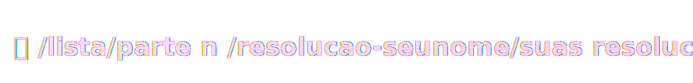

# kortex

Repositório para criar um ambiente de aprendizado através de resumos, links, exercícios e outros recursos.  
> ⚠️ Não adicione materiais protegidos por direitos autorais, conteúdo pago ou links para algo pirateado.
---
## Você pode contribuir:
- Adicionar suas versões das correções dos exercicios
  - Seguir o padrão:
    > 
- Sugerir alterações no código dos outros
- Adicionar QUALQUER COISA que quiser
- Sugerir outras regras e etc

---

**Contribuidores:**  

